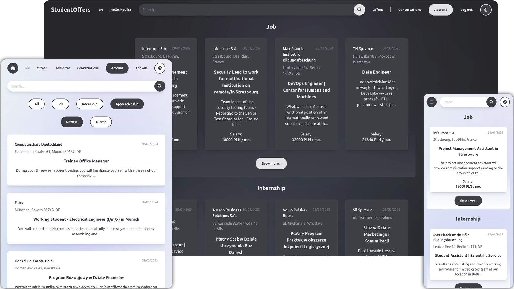

<h1 align="center">StudentOffers</h1>

## Overview

The site was created using React.js and Django. It is a continuation of my original project of a website with offers for students, which was part of my Engineering Thesis. The site will be further developed, as it is also a project for learning new skills as well as testing different solutions.

## Features

- Student or company account registration
- Offer management:
    - Adding, editing and deleting offers
    - Filtering offers by selected category
    - Sorting offers from newest or oldest
- Account panel with your offers
- Conversation panel:
    - Chat that allows communication between the student and the company
    - Ability to send files, photos or gifs via chat
- Intuitive simple interface
- UI in two languages:
    - English, Polski
- Full responsiveness
- Light and dark mode